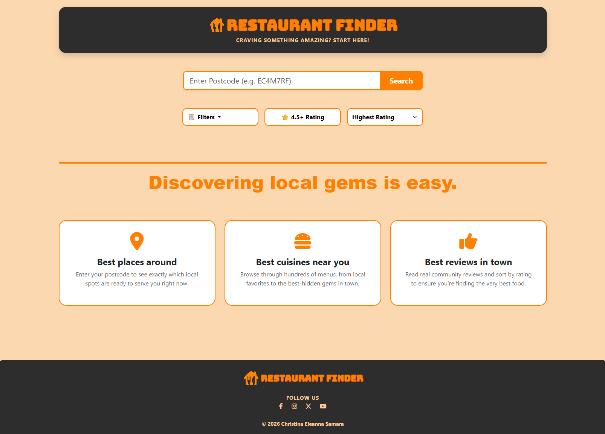
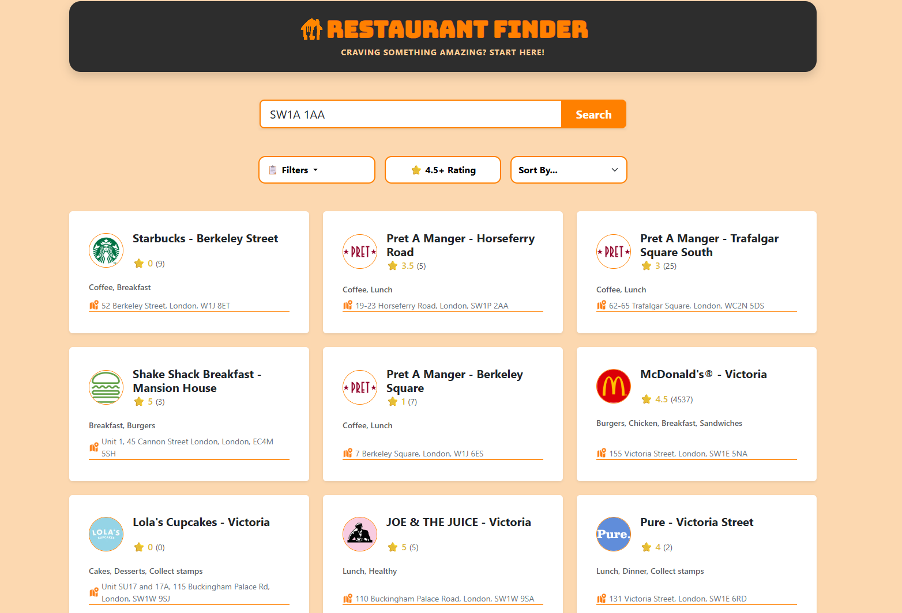
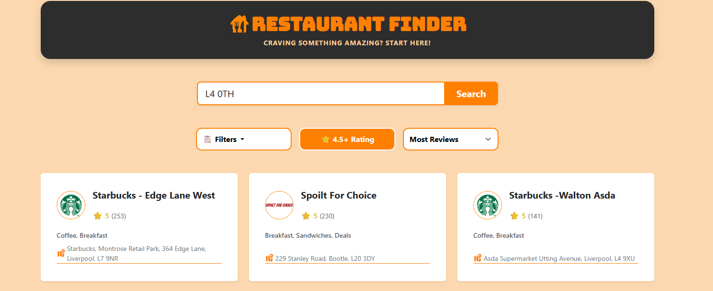
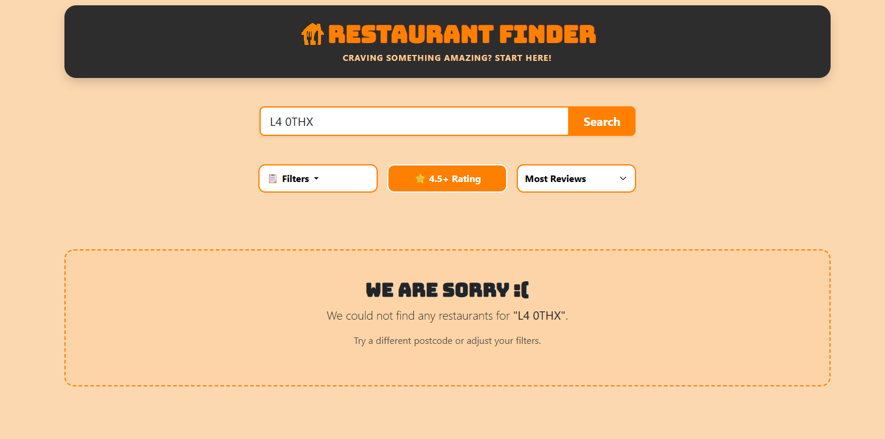

## 🍴 Restaurant Finder App

This application is a restaurant discovery tool built for the Just Eat Takeaway.com Early Careers Program. It interfaces with the official Discovery API to fetch live restaurant data based on a user-provided UK postcode. The project was developed to provide a clean, user-friendly interface that focuses on clear data presentation.

### Build and Run 
1. Clone the Repository:
git clone https://github.com/christinasamara/restaurant-discovery-service-jet

2. Set up a Virtual Environment (optional but recommended):
python -m venv venv
source venv/bin/activate (Mac/Linux) or venv\Scripts\activate (Windows)

3. Install Dependencies:
pip install flask requests

4. Run the Application:
python app.py

5. View the App:
Open your browser and navigate to http://127.0.0.1:5000

### Technologies Used
* Python & Flask: Chosen as the backend framework for its speed, simplicity and API handling.
* Bootstrap 5: Used for the frontend grid system to ensure the interface is responsive across mobile and desktop devices.
* Jinja2 Templates: Used to dynamically render restaurant cards and handle conditional logic for empty search states or error messages.

### Assumptions and Decisions
* Data Scope: The API includes cafes and grocery stores alongside traditional restaurants. I assumed the user wants to see all available food options for their postcode, so I did not filter these out.
* Cuisine Data & Filters: The API includes "Deals," "Promotions," and "Stamps" within the cuisine array. I included these alongside actual food/cuisine types so that users could use the filter system to find special offers as well as specific cuisines.
* Information: The API returns a large amount of data, but I focused strictly on the four points required by the brief: Name, Cuisines, Rating, and Address. I added the "Review Count" and the "Logo" to provide more context for the user.
* State Management: Implemented a welcome screen for visitors and clear "No Results" messaging for empty searches.

### Functionality
* Postcode Search: Users can enter a UK postcode to see a list of local dining options.
* Data Focus: The interface limits the display to the first 10 restaurants returned.
* Filtering: Users can filter results by specific tags like "Deals," "Rating," or specific cuisines.
* Sorting: The interface allows users to sort restaurants by their star rating or the volume of reviews.
* Informative Cards: Each card displays the restaurant's logo, name, cuisine types, numeric rating with review count, and full address.

### Future Improvements
* Dedicated Restaurant Pages: A "View Details" page for every restaurant. This would give users space to see more info that does not fit on the main summary card. Maybe also options for seeing the menu, booking a table or ordering delivery & takeaway.
* Delivery Logistics: Using the restaurant's coordinates and delivery data to show.
* Reversible Sorting Options: Adding "lowest to highest" options for all sorting categories.
* Better Category Filtering: Filter different categories like restaurant, cafe, and grocery store
* Cleaning up Cuisines and Promotions: Separate actual food types like Italian or Thai from promotional tags like "Deals" or "Stamps."
* Pagination: Adding a "Load More" button or infinite scroll to let users explore more than the initial 10 results.

### Screenshots
### Start Page

### Results for postcode L4 0TH

### Filtering by Breakfast, with 4.5+ rating, sorted by Most Reviews

### Empty Search

### Unit Testing & Quality Assurance
To ensure the application is robust and handles various user scenarios, I implemented some unit tests using Python’s unittest framework. These tests simulate user interactions and verify that the application logic handles both successful data retrieval and potential errors from the Just Eat Discovery API.

* Home Page Accessibility: Verifies that the main landing page loads correctly with a 200 OK status and contains the correct branding elements. 
* Search Logic Execution: Confirms that the application can process a postcode query and navigate the search results logic without crashing.
* Error Handling: Specifically tests how the application reacts to invalid postcodes or 404 responses from the Just Eat API, ensuring the app stays live and displays a user-friendly message.
* State Integrity: Ensures that if no postcode is provided, the application correctly maintains the "How to search" welcome state instead of showing empty result sets.

#### How to run the tests:
python test_app.py

You should see a message indicating all tests passed (OK). If the upstream API returns a 404 during testing, the application is designed to handle this gracefully, which will be reflected in the test logs.